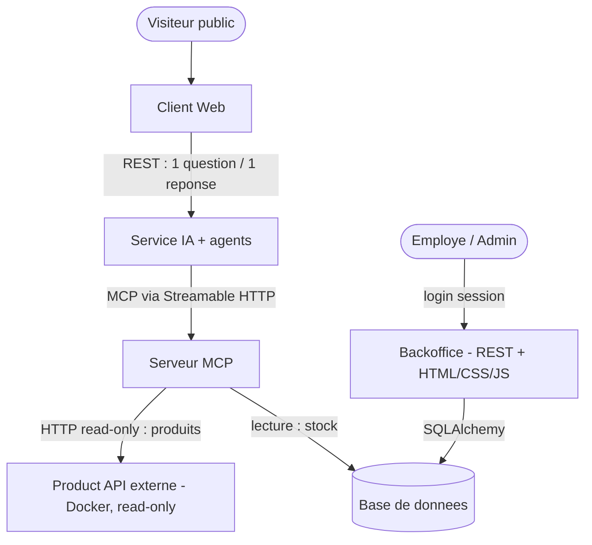

# Document d'architecture — HBntory
 
## 1. Les services du système
 
| Service | Responsabilité |
|---|---|
| **Backoffice** | Appli web interne, protégée par login. Les employés gèrent le stock de leur boutique, l'admin gère les comptes utilisateurs. |
| **Base de données** | Stocke les utilisateurs, les boutiques et les quantités de stock. Aucun détail produit. |
| **Product API** | Catalogue externe (fourni en Docker, lecture seule) qui fournit les infos produit à l'employé et au service IA. Non codé par nous. |
| **Serveur MCP** | Pont entre le service IA et les données. Expose des outils produits (lister, détails) qui appellent le Product API, et des outils stock qui lisent la base. |
| **Service IA** | Reçoit les questions du public, utilise l'IA + les outils pour répondre avec les vraies données. N'invente jamais : si l'info n'existe pas, il le dit. |
| **Client Web** | Page publique, sans login, où le visiteur pose des questions sur les produits et le stock, et lit la réponse de l'IA. |
 
**Répartition de l'équipe :**
- Anil : Serveur MCP, Service IA.
- Marie : Backoffice, Base de données, Client Web (front).
- Product API : fourni, codé par personne.

## 2. Comment les services communiquent

Flux détaillé (légende du diagramme) :

- **Produits :** Client Web → Service IA → Serveur MCP → Product API
- **Stock :** Service IA → Serveur MCP → Base de données
- **Interne :** Employés → Backoffice → Base de données
Chaque service ne parle qu'à son voisin direct. Le Client Web ne connaît que le Service IA ; il ignore l'existence du MCP et du Product API.
 
## 3. Données stockées localement (notre base)
 
- Utilisateurs : login, mot de passe hashé, rôle, boutique assignée, statut actif/supprimé.
- Boutiques.
- Stock : identifiant de boutique + SKU du produit + quantité.
Aucun détail produit (nom, prix, description, image) n'est stocké localement.
 
## 4. Données provenant de l'API produit externe
 
- Nom, description, catégorie, marque, prix, fournisseur, tags du produit.
- Identifiants du produit : `id` (technique) et `sku` (code métier, ex. `HB-LAP-1001`).
- Le stock N'EST PAS dans l'API : c'est à nous de le gérer dans notre base.
**Décision :** dans notre table stock, on relie le stock au produit par son **SKU**, pas par son `id`. Le SKU est un identifiant métier stable, alors que le `id` est un identifiant technique susceptible de changer si l'API est reconstruite.
 
## 5. Comment l'agent IA accède aux produits et au stock
 
- **Produits :** via le Serveur MCP, qui appelle le Product API.
- **Stock :** via le Serveur MCP aussi, étendu avec des outils de stock qui lisent la base.
- **Justification :** réutiliser un seul composant (le MCP) pour les deux sources, et garder une frontière propre — l'IA ne touche jamais la base directement, elle passe toujours par les outils MCP.
## Notes techniques
 
- Le Product API tourne sur `http://localhost:5001` (port exposé par le docker-compose fourni ; en interne le conteneur écoute sur 5000).
- Catalogue : 40 produits, 5 fournisseurs.
- Endpoints utiles : `GET /api/v1/products` (liste), `GET /api/v1/products/<sku>` (détails), `GET /api/v1/products/search?q=...` (recherche).
- Paramètres de test de robustesse : `?simulate_delay_ms=750` (lenteur), `?force_error=true` (erreur forcée).