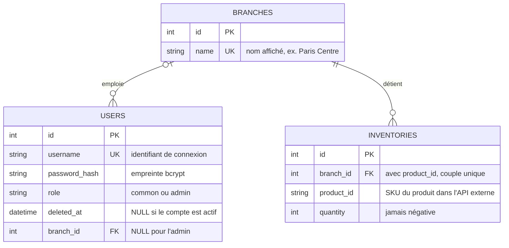

# Schéma de la base de données (Task 1)

Base **SQLite** (`backoffice/inventory.db`), accédée uniquement par le Backoffice
via **SQLAlchemy** (`backoffice/models.py`). Le serveur MCP la lit en **lecture
seule** pour ses outils de stock.

Règle de fond : **aucun détail produit n'est stocké ici.** La base ne garde que
le SKU, qui sert de lien vers l'API Produit externe.

## Vue d'ensemble

Ce diagramme décrit la **structure de la base**. Il complète le schéma
d'**architecture** (`presentation/architecture-hbntory.svg`), qui décrit les
services et leurs échanges : là-bas, tout ceci tient dans la boîte
« Base de données ».



Deux cardinalités à savoir défendre :

- **`|o` côté boutique pour `users`** : un employé appartient à **exactement une**
  boutique, mais l'admin n'en a **aucune** (`branch_id` à `NULL`) — il ne gère
  pas de stock.
- **`||` côté boutique pour `inventories`** : une ligne de stock appartient
  toujours à une boutique existante (clé étrangère non nulle).

## Les trois tables

### `branches` — les boutiques

| Colonne | Type | Contraintes | Rôle |
|---|---|---|---|
| `id` | INTEGER | clé primaire | identifiant technique |
| `name` | VARCHAR(100) | non nul, **unique** | nom affiché (« Paris Centre ») |

Le nom est unique : c'est lui que l'utilisateur et l'agent IA emploient pour
désigner une boutique (« Quels produits à Lyon Part-Dieu ? »).

### `users` — les comptes du Backoffice

| Colonne | Type | Contraintes | Rôle |
|---|---|---|---|
| `id` | INTEGER | clé primaire | identifiant technique |
| `username` | VARCHAR(50) | non nul, **unique**, indexé | identifiant de connexion |
| `password_hash` | VARCHAR(255) | non nul | empreinte **bcrypt**, jamais le mot de passe |
| `role` | VARCHAR(20) | défaut `"common"` | `common` (employé) ou `admin` |
| `deleted_at` | DATETIME | nullable, défaut `NULL` | date de désactivation (soft delete) |
| `branch_id` | INTEGER | clé étrangère → `branches.id`, nullable | boutique assignée |

- `role` a pour défaut `common` : un compte créé sans rôle explicite n'est
  **jamais** administrateur (moindre privilège).
- `deleted_at` porte le **soft delete** : la ligne reste, la connexion est
  refusée. Aucune ligne de stock n'est perdue quand un employé part.
- `branch_id` est nullable parce que l'administrateur n'est rattaché à aucune
  boutique — il ne gère pas de stock. Un employé, lui, en a toujours une.

### `inventories` — le stock, par boutique et par produit

| Colonne | Type | Contraintes | Rôle |
|---|---|---|---|
| `id` | INTEGER | clé primaire | identifiant technique |
| `branch_id` | INTEGER | clé étrangère → `branches.id`, non nul | boutique concernée |
| `product_id` | VARCHAR(50) | non nul, indexé | **SKU** du produit dans l'API externe |
| `quantity` | INTEGER | non nul, défaut `0` | quantité disponible |

Contrainte d'unicité **`uq_branch_product` sur (`branch_id`, `product_id`)** :
une seule ligne de stock par couple boutique/produit. Deux lignes ne peuvent
donc jamais se contredire sur la même quantité.

## Relations

```
branches 1 ─── N users        (un employé appartient à une seule boutique)
branches 1 ─── N inventories  (une boutique porte plusieurs lignes de stock)
```

Côté SQLAlchemy, ces liens sont déclarés avec `relationship()` /
`back_populates` dans `models.py`.

## Où les règles sont appliquées

| Règle | Appliquée par |
|---|---|
| Un employé appartient à exactement une boutique | `branch_id` + contrôle à la création du compte |
| L'admin ne gère pas de stock | API : `403` sur `POST /inventories` si `role == "admin"` |
| Un employé n'agit que sur SA boutique | API : `403` si `branch_id` ≠ celui du jeton |
| La quantité ne devient jamais négative | API : `400` si `quantity < 0` |
| La quantité est un entier | Pydantic : `422` sur une décimale ou du texte |
| Le SKU existe dans le catalogue externe | API : appel à l'API Produit avant écriture, `400` sinon |
| Pas de doublon (boutique, produit) | **Base** : contrainte `uq_branch_product` |
| Un compte supprimé ne se connecte plus | API : `deleted_at` vérifié à chaque requête |
| Un seul administrateur | API : `403` si le rôle `admin` est demandé |

**Choix assumé :** la validation métier vit dans l'API (`backoffice/main.py`),
pas dans la base. Raison : les messages d'erreur restent explicites pour
l'interface (« Ce produit n'existe pas dans le catalogue. »), et la vérification
du SKU exige un appel réseau à l'API Produit, ce qu'une contrainte SQL ne peut
pas faire. La base garde ce qu'elle sait garantir seule : unicité, clés
étrangères, non-nullité.

## Données initiales

`backoffice/seed_data.py` crée les tables puis insère : **3 boutiques**
(Paris Centre, Lyon Part-Dieu, Marseille Prado), **1 admin** (`admin`, sans
boutique), **1 employé** (`employe_paris`, rattaché à Paris Centre) et
**12 lignes de stock** (4 par boutique). Les deux mots de passe sont hachés avec
bcrypt avant insertion : aucun mot de passe en clair n'entre en base.

Le script est **rejouable** : il remet le stock aux valeurs de référence, ce qui
permet de repartir d'un état propre entre deux démonstrations.
