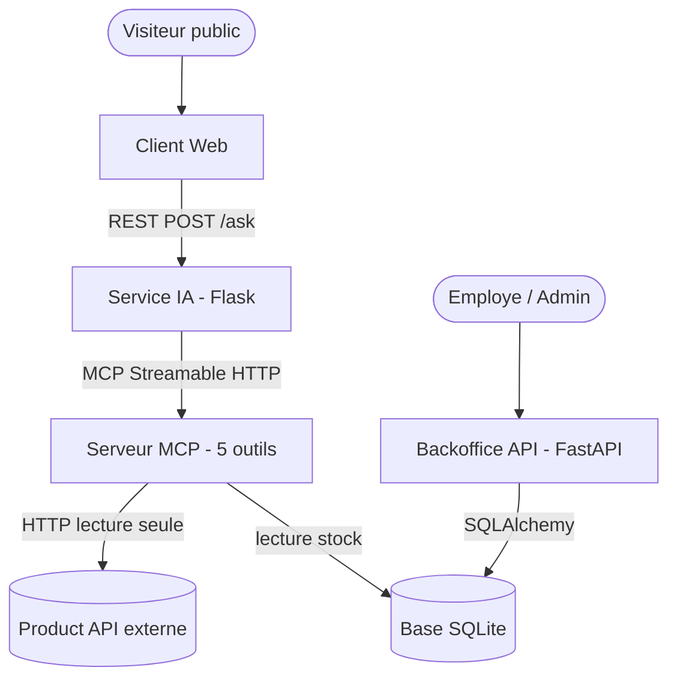
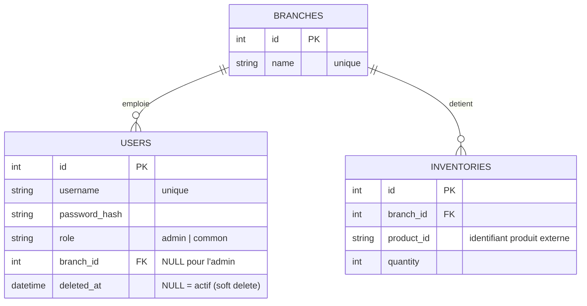

# Guide du code — hbntory

Documentation développeur du système hbntory. Elle décrit les deux sous-systèmes
et comment ils s'assemblent :

| Sous-système | Techno | Dossier | Auteur |
|---|---|---|---|
| **Backoffice** (API interne + base de données) | FastAPI + SQLAlchemy | `backoffice/` | Marie |
| **Serveur MCP + Service IA** (produits, stock, agent) | FastMCP + Flask + Groq | `product_mcp_server/`, `ai_service/` | Anil |
| Product API (catalogue externe) | fourni | — | fourni |

---

## 1. Architecture générale



- Le **Backoffice** (Marie) et le **Service IA** (Anil) sont deux services **indépendants**, avec deux publics différents (interne authentifié vs public anonyme).
- L'agent IA ne touche jamais la base directement : il passe par les **outils du serveur MCP**.
- Aujourd'hui le MCP lit le stock dans un fichier `stock_data.json` (bouchon) ; à l'intégration il lira la table `inventories` du Backoffice (voir §7).

---

## 2. Le schéma de la base de données (Backoffice)

Trois tables. Aucune donnée produit n'est stockée (seulement un identifiant produit).



| Table | Colonnes | Rôle |
|---|---|---|
| `branches` | `id`, `name` (unique) | Les boutiques |
| `users` | `id`, `username` (unique), `password_hash`, `role`, `branch_id` (FK, nullable), `deleted_at` (nullable) | Les comptes ; `deleted_at` renseigné = compte désactivé (soft delete) |
| `inventories` | `id`, `branch_id` (FK), `product_id` (texte), `quantity` | Le stock : une quantité, pour un produit, dans une boutique |

**Points de conception à connaître :**
- Le produit est référencé par un simple `product_id` (texte) → **aucun détail produit en base** (nom/prix viennent de l'API externe).
- Soft delete via `deleted_at` : on ne supprime jamais la ligne, on l'horodate.
- La non-négativité du stock est vérifiée **dans le code de l'endpoint** (voir `main.py`), pas par une contrainte de base.

---

## 3. Backoffice (Marie) — FastAPI

### `backoffice/database.py` — connexion à la base
```python
DATABASE_URL = "sqlite:///./inventory.db"
engine = create_engine(DATABASE_URL, connect_args={"check_same_thread": False}, echo=True)
SessionLocal = sessionmaker(autocommit=False, autoflush=False, bind=engine)
class Base(DeclarativeBase): pass
def get_db():
    db = SessionLocal()
    try: yield db
    finally: db.close()
```
- `engine` : la connexion à la base SQLite (`inventory.db`). `echo=True` : affiche les requêtes SQL (utile en debug).
- `SessionLocal` : fabrique de sessions (une session = une conversation avec la base).
- `Base` : la classe mère de tous les modèles.
- `get_db()` : **dépendance FastAPI** — ouvre une session pour une requête, la ferme à la fin (`yield` puis `finally`). C'est ce qui garantit qu'on n'oublie pas de fermer la connexion.

### `backoffice/models.py` — les tables (SQLAlchemy 2.0)
- `Branch` : `id`, `name` (unique). Relations vers `users` et `inventories`.
- `User` : `id`, `username` (unique), `password_hash`, `role` (défaut `"admin"`), `deleted_at` (soft delete), `branch_id` (FK nullable).
- `Inventory` : `id`, `branch_id` (FK), `product_id` (texte), `quantity` (défaut 0).
- Style moderne `Mapped[...]` / `mapped_column(...)` ; `relationship(back_populates=...)` relie les objets entre eux (ex. `branch.users`).

### `backoffice/schemas.py` — validation des entrées/sorties (Pydantic)
- Définit ce que l'API **accepte** (`...Create`) et **renvoie** (`...Response`) : `Branch`, `User`, `Inventory`, plus `Token`.
- `model_config = ConfigDict(from_attributes=True)` : autorise Pydantic à lire directement un objet SQLAlchemy pour le transformer en JSON.
- **Pourquoi c'est utile :** FastAPI valide automatiquement le corps des requêtes contre ces schémas (types, champs obligatoires) et sérialise proprement les réponses. `UserResponse` **n'inclut pas** `password_hash` → le hash n'est jamais renvoyé au client.

### `backoffice/auth.py` — ✅ écrit par Marie, à pousser
`main.py` importe ce module et utilise :
- `pwd_context` : un `CryptContext` (passlib) pour **hacher** (`.hash`) et **vérifier** (`.verify`) les mots de passe — typiquement **bcrypt**.
- `create_access_token(data)` : génère un **JWT** signé (jeton d'accès) à partir du nom d'utilisateur.
- `get_current_user(...)` : **dépendance** qui lit le jeton `Bearer`, le décode, et renvoie l'utilisateur courant depuis la base. C'est elle qui protège les endpoints (`Depends(auth.get_current_user)`).
- (Il faut aussi un `oauth2_scheme = OAuth2PasswordBearer(tokenUrl="token")` et une `SECRET_KEY`.)

> ℹ️ Marie a écrit ce fichier mais **ne l'a pas encore poussé** sur la branche `backoffice`. Tant qu'il n'est pas là, l'appli ne démarre pas (`ModuleNotFoundError: No module named 'auth'`) → **elle doit le pusher**. La description ci-dessus est déduite de son usage dans `main.py` ; son fichier réel fait foi.

### `backoffice/main.py` — l'API REST
`Base.metadata.create_all(bind=engine)` crée les tables au démarrage. `CORSMiddleware` autorise le front à appeler l'API. Chaque endpoint reçoit `db` (via `get_db`) et souvent `current_user` (via `get_current_user` → route protégée).

| Méthode + route | Rôle | Contrôle d'accès |
|---|---|---|
| `POST /register` | Créer un utilisateur (mot de passe **haché** avant stockage) | public |
| `POST /token` | Login : renvoie un **JWT** ; refuse si compte `deleted_at` | public |
| `POST /branches` · `GET /branches` | Créer / lister les boutiques | authentifié |
| `GET /inventories/{branch_id}` | Voir le stock d'une boutique | non-admin ⇒ **seulement sa boutique** (sinon 403) |
| `POST /inventories` | Créer / mettre à jour du stock | **admin interdit** ; employé ⇒ **sa boutique uniquement** ; **quantité ≥ 0** |
| `GET /users` | Lister les utilisateurs | **admin uniquement** |
| `PUT /users/{id}` | Modifier rôle / boutique d'un utilisateur | **admin uniquement** |
| `DELETE /users/{id}` | **Soft delete** (renseigne `deleted_at`) | **admin uniquement** |

**Comment les règles de l'énoncé sont appliquées (toutes côté backend) :**
- *Employé limité à sa boutique* → `if current_user.branch_id != inventory.branch_id: 403`.
- *Admin ne gère pas le stock* → `if current_user.role == "admin": 403` sur `POST /inventories`.
- *Stock jamais négatif* → `if inventory.quantity < 0: 400`.
- *Suppression logique* → `deleted_at = datetime.now(...)` au lieu d'un vrai `DELETE`, et le login refuse un compte désactivé.

---

## 4. Serveur MCP (Anil) — `product_mcp_server/server.py`

Un seul fichier ; chaque fonction `@mcp.tool()` devient un **outil** appelable par l'agent. Transport Streamable HTTP sur `:8000/mcp`, requêtes réseau en `urllib` (bibliothèque standard).

- **`_get_json(path)`** : le **seul** point qui parle à l'API Produit. Centralise les erreurs → messages clairs : 404 « produit introuvable », autre code « API a répondu N », réseau/timeout « API injoignable ». Jamais d'échec silencieux.
- **`list_products(search, limit)`** : liste/recherche des produits ; borne `limit` entre 1 et 100 ; ne renvoie que 5 champs utiles.
- **`get_product(identifier)`** : détails d'un produit par SKU ou id.
- **`_load_branches()`** : lit le stock — la **vraie base du Backoffice** si `STOCK_DB_PATH` est défini (lecture seule via `sqlite3`), sinon le fichier `stock_data.json`. C'est le **seul** endroit qui connaît la source (voir §7).
- **`stock_for_product(sku)`** : dans quelles boutiques un produit est dispo (quantité > 0).
- **`stock_in_branch(branch)`** : ce qu'une boutique a en stock.
- **`check_shopping_list(items)`** : où acheter une liste. Renvoie `fully_satisfied_by` (boutiques qui suffisent seules), `plan` (combinaison de boutiques — algorithme **glouton** `_greedy_plan`), `satisfiable` et `missing`. Répond au « quelle(s) boutique(s) » (pluriel) de l'énoncé.

---

## 5. Service IA (Anil) — `ai_service/`

### `ai_service/agent.py` — la « boucle d'outils »
- `_load_env_file()` : charge la clé `GROQ_API_KEY` depuis `.env` (à l'import).
- `_to_groq_tools(...)` : convertit les outils MCP au format attendu par le modèle (le JSON Schema MCP passe tel quel).
- **`answer_question(question)`** : ouvre la connexion MCP, récupère les outils, puis **boucle** (max `MAX_TOOL_ROUNDS = 5`) :
  1. envoie question + outils au modèle (Groq / Llama) ;
  2. si le modèle **ne demande pas d'outil** → renvoie sa réponse texte ;
  3. sinon, pour chaque outil demandé : l'exécute via le MCP (`print("[tool call] ...")` pour l'observabilité), renvoie le résultat au modèle, reboucle.
- `SYSTEM_PROMPT` : impose de n'utiliser **que** les données des outils et de ne jamais inventer → c'est le *grounding*.
- `ask(question)` : version synchrone (`asyncio.run`) + **déballe** les `ExceptionGroup` du client MCP pour remonter la vraie erreur.

### `ai_service/app.py` — l'endpoint public (Flask)
- `POST /ask` `{question}` → `{answer}` (REST, chaque question indépendante).
- `@app.after_request` ajoute les en-têtes **CORS** (le front est sur un autre port) et répond au préflight `OPTIONS`.
- En cas d'échec de l'agent → **502 + message JSON clair** (le détail est loggué côté serveur, pas exposé au client).

---

## 6. Comment lancer

**Backoffice (Marie)** — nécessite `auth.py` + les dépendances installées :
```bash
cd backoffice
pip install fastapi uvicorn "sqlalchemy>=2" pydantic "passlib[bcrypt]" python-jose python-multipart
uvicorn main:app --reload        # API sur http://127.0.0.1:8000  (doc auto : /docs)
```

**Serveur MCP + Service IA (Anil)** — depuis la racine :
```bash
docker compose up --build        # MCP :8000 (interne) + Service IA :8001
# ou en manuel : python -m product_mcp_server.server  puis  python -m ai_service.app
```
> ⚠️ Le Backoffice (uvicorn) et le serveur MCP écoutent tous deux sur `:8000` par défaut → à faire tourner sur des ports différents lors de l'intégration (ex. Backoffice sur `:8000`, MCP interne au réseau Docker).

---

## 7. L'intégration des deux parties (le point à finir)

L'intégration est **faite**. `_load_branches()` lit la base du Backoffice quand la variable `STOCK_DB_PATH` pointe vers son fichier `inventory.db` : une requête **en lecture seule** (`sqlite3`, `mode=ro`) qui joint `inventories` et `branches` et renvoie `{ boutique: { product_id: quantité } }` — le format attendu par les outils. Sans `STOCK_DB_PATH`, on reste sur le bouchon JSON. Les 5 outils et l'agent sont **inchangés**.

Lancer l'IA sur le vrai stock :
```bash
STOCK_DB_PATH=/chemin/vers/backoffice/inventory.db python -m product_mcp_server.server
```
Testé : lecture du vrai stock ✓ · mise à jour vue en direct ✓ · écriture impossible (lecture seule, la base de Marie n'est jamais modifiée) ✓.

Correspondance à assurer : le `product_id` de la table `inventories` = le **même SKU** que l'API Produit (ex. `HB-LAP-1001`), et les **noms de boutiques** doivent coïncider avec ceux des questions.

---

## 8. Points à compléter (checklist d'intégration)

- [ ] **`backoffice/auth.py`** : écrit par Marie mais **pas encore poussé** → elle doit le pusher (sinon `ModuleNotFoundError`).
- [ ] **`backoffice/requirements.txt`** : à vérifier / pousser (fastapi, uvicorn, sqlalchemy, pydantic, passlib[bcrypt], python-jose, python-multipart).
- [ ] Résoudre le **conflit de port `:8000`** entre uvicorn (Backoffice) et le serveur MCP.
- [x] **Brancher `_load_branches()` sur la table `inventories`** — ✅ fait (via `STOCK_DB_PATH`, lecture seule, testé). Il reste juste à lancer le MCP avec cette variable le jour de l'intégration.
- [ ] Vérifier la cohérence des `product_id` / SKU entre la base et l'API Produit.
- [ ] Optionnel : contrainte de base `CHECK quantity >= 0` (en plus de la vérification applicative) et unicité `(branch_id, product_id)`.
